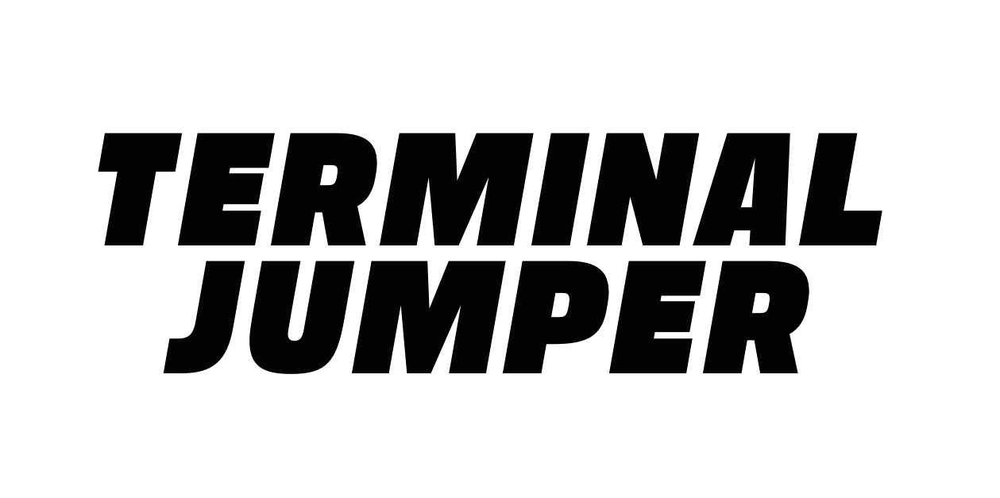
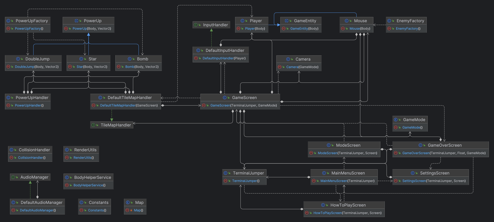
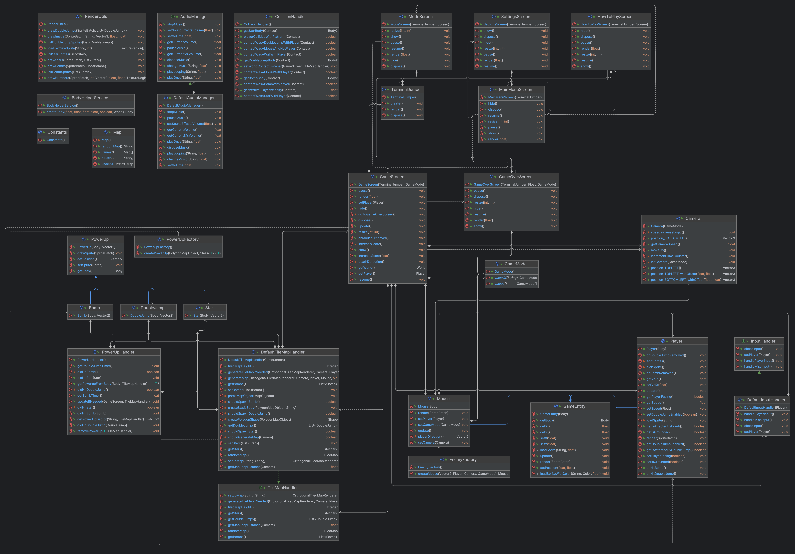
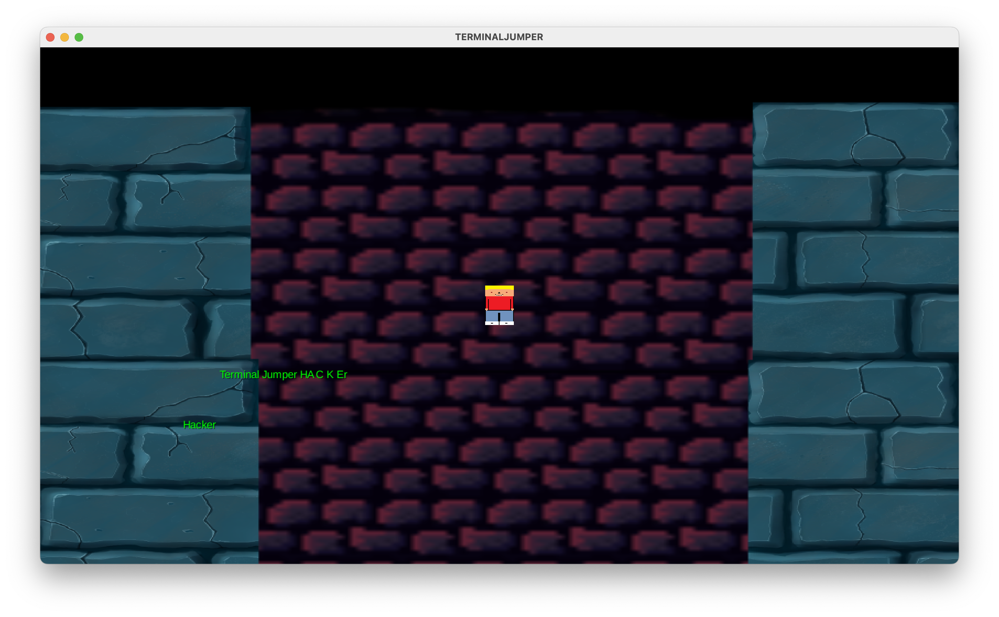
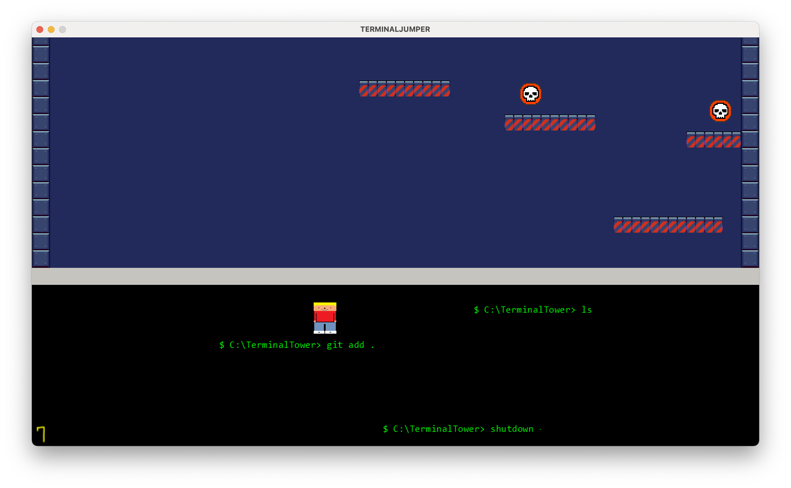
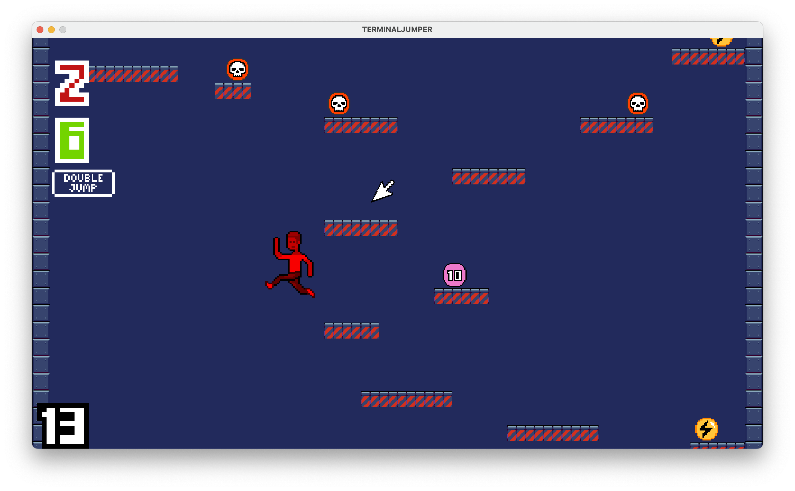

# Oblig 4 - Hackermens



- *Petter Næsset Borja, Lars Magnus Longva, Prem Eide, Viljar Slettli, Aleksander Ljosdal Fedøy, Malin Torset Sivertstøl*
- [Trello](https://trello.com/b/3IqzkDAD/hackermens)
    - Screenshots og en kort beskrivelse av hvordan vi har benyttet oss av Trello er inkludert i rapporten. 
- Manuelle tester finnes i [doc/test/manual_tests.md](./test/manual_tests.md)
- Alle møtereferater er i [doc/referater/referater.md](./referater/referater.md)
- Credits og lisenser er beskrevet i bunnen av [README.md](../README.md)
- En ferdig kompilert [terminaljumper-1.0.0.jar](./binaries/terminaljumper-1.0.0.jar) du finner i dette prosjektet `doc/binaries`
    - Vi var litt i tvil på om spillet fortjente 1.0.0, men vi forhørte oss med gruppeleder :) 

## **Prosjektrapport**
**Hvordan fungerer rollene i teamet? Trenger dere å oppdatere hvem som er teamlead eller kundekontakt?**

- Rollene i teamet fungerer ganske bra. Vi føler på dette tidspunktet at rollene som er satt funker bra og at vi nå ikke trenger å oppdatere på de.

**Trenger dere andre roller? Skriv ned noen linjer om hva de ulike rollene faktisk innebærer for dere.Trenger dere andre roller? Skriv ned noen linjer om hva de ulike rollene faktisk innebærer for dere.**

- Vi har fra første innlevering fått inn en ny på teamet, Prem, som har fått rollen som DevOps fordi DevOps metodologier legger vekt på å automatisere og optimalisere prosesser for å redusere tiden det tar å utvikle og levere programvare. Vi har sett at det kan være viktig at en i teamet har tatt på seg team lead rollen som koordinerer og delegere oppgaver i teamet. Tech lead for oss innebærer at en av oss har overordnet kontroll over koden. Resten av rollene innebærer for det meste kundekontakt og å holde et overordnet kontroll over hva og når oppgavene skal leveres inn. 

**Er det noen erfaringer enten team-messig eller mtp prosjektmetodikk som er verdt å nevne? Synes teamet at de valgene dere har tatt er gode? Hvis ikke, hva kan dere gjøre annerledes for å forbedre måten teamet fungerer på?**

- Vi føler at vi har god kontroll på koden vår nå og har vært flinke til å ta valg sammen. Vi har vært flinke til å ikke overvelde oss slik at vi leverer pen og ryddig kode i stedet for noe halvferdig som verken ser bra ut eller er ryddig. Med andre ord unngått å overscope.

**Hvordan er gruppedynamikken? Er det uenigheter som bør løses?**

- Vi har tidligere hatt problemer med sent oppmøte eller at folk ikke dukker opp uten å gi beskjed til gruppen. Dette har blitt litt bedre, men er fortsatt et problem. Gruppedynamikken har blitt veldig bra nå som vi nærmer oss sluttstadiet og vi har blitt enige i hvordan spillet skal funke og se ut. Det var noe som vi slet med i starten, men har nå i senere tid funnet ut av det og fått en klarere plan.

**Hvordan fungerer kommunikasjonen for dere?**

- Som sagt har kommunikasjonen falt litt kort når det gjelder å si ifra om folk er forsinket eller ikke kan møte på noen av møtene. Discord har stor sett fungert greit som kommunikasjonskanal.

**Under vurdering vil det vektlegges at alle bidrar til kodebasen. Hvis det er stor forskjell i hvem som committer, må dere legge ved en kort forklaring for hvorfor det er sånn. Husk å committe alt. (Også designfiler)**

- I starten av prosjektet hadde vi problemer med skjelettkoden, og ble enige om at et par skulle fikse opp i dette for å unngå rot Samtidig fikk vi i løpet av prosjektet i praksis to nye medlemmer, en som ikke møtte opp før uke 3, og en som senere kom inn fra en annen gruppe. Vi brukte derfor tid på å integrere de i koden vår og justerte prosjektet til flere medlemmer. 

- Vi har også prøvd å fordele oppgaver, slik at noen fokuserer mer på skrivingen, lage spillbrett og sprites, mens andre har fått i oppgave å implementere forskjellige metoder og funksjonalitet. Vi har også parprogrammert der vi bruker en pc til å committe. Samtidig har vi blitt enige om at en person skal gå over innleveringen før den leveres inn, for å kontrollere og rydde opp i prosjektet slik at vi er sikre på at det vi leverer er godt nok. 

**For siste innlevering (Oblig 4): Gjør et retrospektiv hvor dere vurderer hvordan hele prosjektet har gått. Hva har dere gjort bra, hva hadde dere gjort annerledes hvis dere begynte på nytt?**

På retrospektivet vårt kom vi frem til at alle er generelt veldig fornøyd med hvordan prosjektet har gått. Det er noen punkter vi er spesielt fornøyde med:

- Alle har vært flinke til å bidra, vi har vært flinke til å sette oss ukentlige gjøremål og dele oppgaver. 
- Vi er fornøyde med at vi har et referat å se tilbake på fra ukene og at vi har god dokumentasjon. Vi brukte Scrum-teknikken, som fungerte godt.
- I tillegg har folk jobbet selv om de ikke kunne komme på møtet. Prosessen med å ta inn et nytt medlem underveis gikk også veldig greit!
- Vi har fått en god arbeidsflyt i henhold til git, noe som har bidratt til at prosessen med å legge inn ny kode og unngå konflikter i git ble mye bedre. Vi ble enige om at man burde få noen andre til å se over og godkjenne merge requests. Dette har fungert godt og har bidratt til mindre bugs. 

Vi ble også enige i at det er noen ting vi kunne gjort bedre om vi hadde startet på nytt:

- Være mer klar på ting fra starten, det vil si tydeligere planlegging og kartlegging av hva vi vil gjøre.
-  Sørget for at alle er "på samme side", at vi har en god felles forståelse for hva vi vil oppnå med ulik funksjonalitet og design Dette ble aldri et stort problem underveis, men vi har gått litt fram og tilbake på noen valg på grunn av dette.
- Starte tidligere med sprinter, noe vi ikke startet med før litt ut i prosjektet. 
- Bli enige om tydelige regler for git-bruk fra starten av, inkludert å beskytte Main-branchen. I tillegg kunne det vært lurt å bruke ett eller to møter på å sørge for at alle er komfortabel med bruk av git. 

## **Krav og spesifikasjon**

### MVP-kravene våre:

```
1. Vise startskjerm.
2. Ha fungerende knapper/funksjoner til startskjermen. 
3. Vis spiller på spillebrettet. 
4. Flytt spiller (inklusiv tyngdekraft, kunne hoppe)
5. Spiller interagerar med terrenget. 
6. Dynamisk grafikk avhengig av hvor spilleren befinner seg. 
7. Spiller kan dø (dersom man faller utenfor skjermen eller at skjermen tar den igjen).
8. Mål for spillbrett (oppnå høyest mulig poengscore, overleve lengst mulig eller hoppe høyeste mulig).
9. Nytt spillbrett når forrige er ferdig.
10. Game over skjer (viser statistikk for runden, start på nytt knapp). 
```

**Oppdater hvilke krav dere har prioritert, hvor langt dere har kommet og hva dere har gjort siden forrige gang. Er dere kommet forbi MVP? Forklar hvordan dere prioriterer ny funksjonalitet.**

- Til siste oblig har vi prioritert å bli ferdige med kravene som står i semesteroppgaven på git. Dette inkluderer powerups, en hjelpeside, lyd til spillet, skrive tester og endre på spillmodus. I oblig 3 ble vi ferdige med alle MVP kravene våre. 
- Til denne obligen har vi finpusset på funksjonaliteten, og i tillegg lagt inn ekstra funksjonalitet. Dette er beskrevet lenger nede i rapporten, under Produkt og Kode.

**For hvert krav dere jobber med, må dere lage (1) ordentlige brukerhistorier, (2) akseptansekriterier og (3) arbeidsoppgaver. Husk at akseptansekriterier ofte skrives mer eller mindre som tester**

- Implementere et powerup system
    1. Som bruker vil jeg at spillet skal være spennende og utfordrende.
    2. Da trenger vi at ting interagerer og endrer atferden til spilleren. Og at det blir plassert powerups rundt i spillet som gir spilleren en midlertidig fordel eller ulempe.
    3. For å gjennomføre dette må vi lage en PowerUpFactory klasse som spawner selve powerup objektet. Vi må også opprette flere metoder i RenderUtils.java som tegner powerup spritene. Vi må oppdatere metoder i CollisionHandler for å oppdage når spilleren treffer en powerup og kalle på rigtige metoder i PowerUpHandler klassen. Vi må også opprette nødvendige metoder i GameScreen klassen for å øke score på skjermen.

- Lage en hjelpeside
    1. Som bruker vil jeg lett få oversikt over hvordan man spiller spillet.
    2. Da må vi ha en oversiktlig og lett å finne hjelpe side med oversikt over hvordan man spiller spillet. 
    3. For å oppnå dette trenger vi en klasse som heter HowToPlayScreen.java som tar inspirasjon fra MainMenuScreen.java, men som viser en oversikt over hvordan spillet skal spilles og hvordan man skal styre spilleren.

- Lyd til spillet
    1. Som bruker vil jeg ha musikk og lydeffekter i spillet. 
    2. Da må finne musikk som vi kan bruke gratis og copyright free. 
    3. For å implementere dette lager vi et grensesnitt AudioManager.java og en klasse DefaultAudioManager.java som holder kontroll på de ulike metodene som brukes for å få til musikken. Lydeffektene blir kalt på i metodene som når spilleren hopper.

- Tester
    1. Som utvikler vil jeg ha tester for å sjekke om spillet fungerer slik jeg vil det skal.
    2. Da trenger vi å ha tester inne i en egen mappe som heter test/java/terminalJumper.
    3. For å få til dette må vi implementere tester som sjekker de ulike metodene våre.

- Endre på spillmodus
    1.  Som utvikler vil jeg at spillet skal være utfordrende
    2.  Da må vi ha forskjellige spillmodus som classic, og expert der spillet går raskere.
    3.  For å oppnå dette må vi opprette metoder i Camera klassen som får kameraet til å bevege seg gradvis raskere oppover. Vi må også implementere logikk for å endre spillinnstillingene basert på valgt spillmodus. Dette gjør vi ved å lage en enum klasse (GameMode.java) med to vanskelighetsgrader (classic og expert). Vi må oppdatere konstruktøren i Camera-klassen til å ta inn en GameMode som parameter/argument som avgjør hvilken hastighet kameraet skal ha. Vi må også opprette en meny i hovedmenyer som du kommer inn på etter du trykker start. Her får du valget mellom to knapper (classic og expert).

## Bugs

- Dobbelthopp på MacOS føles enda ikke helt bra. 
  - Spesifikt vil det andre hoppet noen ganger ikke registreres når du trykker SPACE, dette er knyttet til "isKeyJustPressed" i LibGDX. 
  - Dette var også et problem ved forrige innlevering, men da risikerte man å ikke få hoppet i det hele tatt. Dette er blitt kraftig forbedret og denne bugen gjelder nå bare det andre hoppet. 
- Noen power-ups og bomber i spillet kan ha en feilformet hitbox, slik at den blir større enn spriten og gjerne trapesformet. Spilleren kan da treffe disse uten at det visuelt gir mening.
    - Dette er strengt tatt ikke en bug, men hitbox til musepeker-fienden er heller ikke optimal. Per nå dreper den bare spilleren om den får tak i føttene hans.
- Resizing eller fullscreen på Windows og Linux kan medføre at UI-elementer og grafikk deformeres. Kan "fikses" ved å gå litt ut og inn av fullscreen, eller bytte "skjermer" i spillet.
- Krasj ved resizing av vindu på macOS
  - Kjent problem i LibGDX som kan være spesifikk til M1-prosessorer

På grunn av de to sistnevnte feilene med resizing er denne funksjolatiteten foreløpig slått av.

## Produkt og Kode

**Dette har vi gjort siden sist:**

1. Forbedret kode
    - Separert logikk
        - Input handling / samhandling med tastaturet er flyttet ut av Player
        - Collision detection og handling er flyttet ut av GameScreen
    - Factories for fiender (musepekeren), pickups
2. Estetiske oppdateringer 
    - Nye sprites for spilleren, med visuell effekt for slowdown
    - Nye sprites for powerups og powerdowns
    - Opppdatert UI og menyskjermer
    - Lagt inn flere lydeffekter
3. Skrevet flere tester, derav kodetester
4. Endret på powerups og powerdowns
    - Dobbelthopp er nå en midlertidig powerup
    - Bomber gjør deg midlertidig treg fremfor å drepe deg
    - Lagt inn en pickup som gir deg bonuspoeng
5. Utvidet spillet
    - "How to play" skjerm
    - Lagt inn to forskjellige vanskelighetsgrader
        - Avgjør hvor fort kameraet akselerer og hvor rask musepeker-fienden er, altså hvor mye feilrom du har
    - Lagt inn en fiende "Musepeker", som er styrt av spillet og følger etter deg, dreper deg om den tar deg.

...og kanskje mer. Siden vi var ferdig med MVP-kravene våre til Oblig 3, har vi brukt denne innleveringen på finpuss og bonusfunksjonalitet.

Om vi skulle jobbe videre på spillet ville vi fokusert på å fikse bugs, samt rydde enda mer opp i koden. Vanskelighetsgraden og overall game balance trenger også justering, noe som ville krevd testing fra helt nye spillere.

## Klassediagram og arkitektur

Hvis diagrammene ikke vises ordentlig her er bildene tilgjengelige i `doc/img/oblig4`, og uml-filer for IntelliJ i `doc/uml`. Grunnet størrelsen til klassediagramet er noen detaljer utelatt fra bildene, selv fra det detaljerte. 

### Arkitektur

Arkitekturen vår er tiltenkt MVC, men i praksis har den blitt litt grumsete. Det er vanskelig å fullstendig unngå at man får view-type metoder i model-metoder men LibGDX, da det ofte kreves en render() funksjon og lignende. Men vi har forsøkt å separere ut ansvar fra klasser, som at `Player`-objektet ikke er ansvarlig for input, eller at `GameScreen` ikke skal håndtere og sjekke for collisions. Akkurat nå håndteres det meste av spillogikken av klasser i `helper`, så denne er i praksis blitt vår de-facto `model`, og kunne nesten ha blitt byttet navn på. Kanskje kan arkitekturen kalles HVC?

`TerminalJumper` gjør initiell oppsett, med andre ord lager den et LibGDX `Game`. Spillet går så gjennom flere screens i `view` for å presentere menyer og det visuelle i spillet, og underveis vil klasser fra `helper` styre spillogikk, sjekke for kollisjoner, generere baner (laste tiles), pickups og lignende. `midi` har ansvaret for å spille musikk og lydeffekter, mens `controller` tar seg av keyboard-input fra spilleren. `objects` definerer objekter som pickups, powerups, musepekeren som jager deg, og selvfølgelig spilleren.

Grumsen er definitivt lærdom å ta med seg videre. Det hadde nok lønt seg å bruke mer tid i starten på å virkelig forstå oppbygningen av et LibGDX-prosjekt og konsekvensene det vil ha for hvordan vi planlegger arkitekturen. Å planlegge arkitekturen er også noe vi kanskje burde brukt enda mer tid på i startfasen.

### Enkelt klassediagram ([UML-fil](./uml/oblig4-simplified-classdiagram.uml))


### Detaljert klassediagram ([UML-fil](./uml/oblig4-detailed-classdiagram.uml))


## Trello

Vi har fordelt Trelloen vår i tavlene `Bugs`, `To-Do`, `Doing`, `Code Review`, `Testing` og `Done`. Alle har hatt tilgang til å lage og redigere kort og tavler, og vi har brukt Trello omtrent fra starten av prosjektet. Tavlene har blitt brukt for å holde oversikt over hva vi må gøre, hvordan enkeltoppgaver ligger an, samt hvem som har ansvar for de. 

Ca. slik vil den se ut under normal bruk:


Under sprinter og rett før innleveringer har vi noen ganger brukt mer spesifikke tavler, her for Oblig 4:


(Skjermbildene er ikke 100% ærlige da de er tatt mot slutten av denne innleveringen, men de viser hvordan vi har brukt Trello.)

### Skjermbilder

Her en sammenligning med spillet over de siste obligene:

**In-game Oblig 2: (statisk skjerm)**
 

**In-game Oblig 3 (midt i transition mellom to typer bane):**


**In-game Oblig 4 (spilleren er slowet og er midt i et hopp):**

