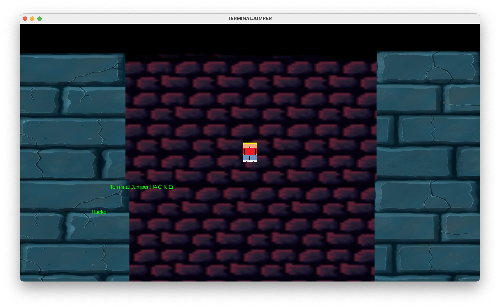

# Oblig 2 - Hackermens

## TERMINALJUMPER

Hovedmeny:


Trykker man på "START", kommer man til en (foreløpig lite interaktiv) Game screen:



## Krav og spesifikasjon

Dette var de tidligere MVP-kravene:

```
1. Vise startskjerm.
2. Ha fungerende knapper/funksjoner til startskjermen. 
3. Vis spiller på spillebrettet. 
4. Flytt spiller (inklusiv tyngdekraft, kunne hoppe)
5. Spiller interagerar med terrenget. 
6. Dynamisk grafikk avhengig av hvor spilleren befinner seg. 
7. Spiller kan dø (dersom man faller utenfor skjermen eller at skjermen tar den igjen).
8. Mål for spillbrett (oppnå høyest mulig poengscore, overleve lengst mulig eller hoppe høyeste mulig).
9. Nytt spillbrett når forrige er ferdig.
10. Game over skjer (viser statistikk for runden, start på nytt knapp). 
```

Denne innleveringen oppfyller 1-3. Som en bonus har spillet lyd, noe som ikke var et av de originale kravene. Per nå kan spillet kjøres (du vil ha mest hell med å kjøre Main i en IDE som IntelliJ), og vil vise en hovedmeny med musikk og fungerende start/avslutt knapper. 

Vi har hatt problemer med oppmøte og kommunikasjon underveis, som har ført til at framgangen tidvis har gått tregt. Implementasjon av bevegelse for spilleren, brett/spillnivå er godt i gang men ikke helt ferdigstilt. Disse funksjonene utelates derfor fra denne innleveringen. Krav som at spilleren kan dø/game over, oppnå poengscore osv er også avhengig av disse spillfunksjonene, og disse kravene faller derfor også bort for nå. 

Til neste innlevering vil vi fokusere på å få implementert resten av punktene, jobbe på å forbedre kodekvalitet, bedre etterfølge SOLID og MVC, samt implementere tester som bygger på det tekniske bak spillet.

### Krav og brukerhistorier:

- Vise startskjerm:
    - Som bruker vil jeg ha en fin og oversiktlig startskjerm slik at jeg kan starte spillet. 
    - Da trenger vi en organisert startskjerm
    - For dette må vi lage en egen klasse som heter MainMenuScreeen.java som inneholder grafikken som gjør startskjermen oversiktlig og en button listener som responderer når brukeren trykker start eller stop.

- Ha fungerende knapper/funksjoner til startskjerm:
    - Som utvikler vil jeg at knappene vi implementerer på startskjermen skal ha riktig funksjon.
    - Da trenger vi Start og Stop knapp, der start knappen gjør at spillet starter og stop gjør at spillet avsluttes.
    -  For dette må vi lage et Table i MainMenuScreen som brukes til å plassere knapper og andre UI-elementer. Inni Table må det lages to knapper, som hver har listeners for trykk. Disse må respondere raskt, og laste spillet eller avslutte programmet. Vi må også designe grafikk for knappene, slik at det for brukeren er tydelig hvilken knapp som gjør hva.

- Vise spiller på spillbrettet:
    - *(Merk at denne brukerhistorien delvis baserer seg på funksjonalitet som ikke er fullt implementert i denne innleveringen)*
    - Som bruker vil jeg kunne flytte rundt på spilleren.
    - Da trenger vi en flyttbar spiller som kan bevege seg til høyre og venstre.
    - For dette må vi lage et Player object i Tiled-filen, og importere spilleren i GameScreen. GameScreen må sjekke for user-input - “A” for venstre, “D” for høyre, “SPACE” for å hoppe. Spilleren må kunne kollidere i og stoppes av plattformer og vegger, og ikke kunne hoppe igjen før han lander. Spilleren skal kunne gå igjennom plattformer på vei oppover, men ikke nedover (lander på plattformene). Kameraet må også følge spilleren, slik at spilleren alltid er synlig.

### Forklar kort hvordan dere har prioritert oppgavene:

- Frem til oblig 2 har vi prioritert å bli ferdig med nesten alle MVP kravene våre. Vi prioriterer å bli ferdig med så mange som mulig uten at koden skal bli dårlig med tanke på lite tid.

### Har dere gjort justeringer på kravene som er med i MVP? 

- Vi har ikke enda gjort endringer i MVP kravene våre, men er noe vi kommer til å se på videre etter oblig 2.
- Vi kommer dessverre ikke i havn med alle punktene. Kode for å laste inn levels/baner er godt i gang, og det samme gjelder bevegelse av spilleren. Dette er derimot ikke i fullt fungerende tilstand, og utelates fra denne innleveringen. Mange av punktene settes derfor som mål til neste milepæl.

### Bugs:

#### Generelle

- Problemer med å kjøre kompilert (buildet) .jar fil
- UI i hovedmeny resizer ikke skikkelig dersom du resizer vinduet

#### MacOS

- Krasj ved resizing av vindu 
  - Kjent problem i LibGDX som kan være spesifikk til M1-prosessorer

### Utbedring av feil

- Det meste av kode og funksjonalitet i spillet har blitt skrevet siden forrige innlevering. Derfor har det ikke vært noe å utbedre, men vi har introdusert nye ting som bør forbedres og fikses til neste gang.

## Diverse punkter

#### Roller

- Rollene i teamet fungerer ganske bra. Vi føler på dette tidspunktet at rollene som er satt funker bra og at vi nå ikke trenger å oppdatere på de.
- Vi har fra første innlevering fått inn en ny på teamet, Prem, som har fått rollen som DevOps fordi DevOps metodologier legger vekt på å automatisere og optimalisere prosesser for å redusere tiden det tar å utvikle og levere programvare. Vi har sett at det kan være viktig at en i teamet har tatt på seg team lead rollen som koordinerer og delegere oppgaver i teamet. Tech lead for oss innebærer at en av oss har overordnet kontroll over koden. Resten av rollene innebærer for det meste kundekontakt og å holde et overordnet kontroll over hva og når oppgavene skal leveres inn. 

#### Erfaringer og vurdering av valg 

- Vi har måtte endre på start koden vår ganske mye, noe som har gjort at flere ikke har fått kodet så mye enda, men planen vår er at når vi får kommet i gang med den skjelett koden som vi skal bruke til slutt skal vi ha noen runder med par progging. Vi synes noen av valgene vi har gjort som et team kanskje ikke har vært så bra men at sammen har vi løst dette med å ta bedre valg de neste gangene og sammen kommet frem til en felles løsning på problemene som har kommet ut av dette.

#### Gruppedynamikk og uenigheter

- Vi har hatt problemer med at folk kommer for sent til møter eller at folk ikke dukker opp uten å gi beskjed til resten av gruppa. Så rundt akkurat dette er det noen uenigheter som trenger å bli løst. Vi tenker å ta opp dette på neste møtet alle er på, på en saklig måte, at folk må komme tidsnok og at det må sies ifra i rimelig til om folk ikke har mulighet til å møtest når vi skal ha møte slik at vi kan planlegge nytt møte når flest mulig kan møte.

#### Hvordan fungerer kommunikasjonen for dere?

- Kommunikasjonen har falt litt kort når det gjelder å si ifra om folk er forsinket eller ikke kan komme på møtene. Men ellers har Discord fungert bra som kommunikasjonskanal. I tillegg har vi blitt litt flinkere på å bruke Trello aktivt.

#### Retroperspektiv

- På retrospektiv kom vi frem til at vi er fornøyde med ting vi har klart til nå men ser klart noen forbedringspunkter. Vi føler at vi har vært flinke med å sette opp møter og at alle får sagt det de vil si, men samtidig så har ikke alle vært like flinke å møte opp på de avtalte møtene. 

#### Forskjeller i antall commits

- Det har vært litt problemer med skjelettkoden. For å gjøre dette mer oversiktlig og ryddig i starten sa vi oss enige i at et par stykker skulle fikse opp i det. Samtidig har vi gjennom prosjektet fått to nye medlemmer, en som ikke møtte opp før tredje møtet og en som kom fra en annen gruppe. Vi har brukt tid på å integrere de i koden vår og justert prosjektet og arbeidsoppgaver til flere medlemmer. 
- Noe av arbeidet (som grafisk design) foregår i program eller på enheter som ikke lett integreres med git. I tillegg bruker vi Google Docs for å samarbeide om rapporter og det skriftlige. Det er også litt naturlig variasjon i om folk foretrekker å gjøre flere små eller færre men større commits.

## Klassediagram


## Møtereferater

### Møte 13.02
- **Lokasjon:** Grupperom på Realfagsbygget
- **Tid:** 1200-1600

---

#### Agenda:

##### Siden sist

- Alle gir en oppdatering på hva de har jobbet med siden sist, f.eks. hva man har fått til, strevet med og trenger hjelp med.
- Lage GitLab-gruppe/Ferdigstille A1
- Rollene er fordelt.
- Petter har laget gruppe inne på Git. 
    - https://git.app.uib.no/groups/hackermens1

##### Prosjektnavn

- Terminal Jumper

##### README-fil

- Petter, eieren av prosjektet, lager README.md. 
- Aleksander skriver README.md filen.
    - Denne legges inn på Git. 

##### Ferdigstille A2

- Lage ferdig beskrivelse av hva som inngår i spillet.
- A2 er ferdigstilt, dette innebærer hva spillet skal inneholde, design, gameplay-loop og utvidelser vi kan legge til i fremtiden. 

##### Oppgave A3

- Velg og tilpass en prosess for teamet
- Gruppen velger Scrum som utviklingsmetode. 
- Vi har ukentlige møter hver onsdag, med mulighet for å møtes flere ganger i uken dersom arbeidsmengden må økes. 

##### Få oversikt over forventet produkt

- Produktet vil ha en stor målgruppe, da spillet kan nå brukere i alle aldre. 
- Vi satser på å utvikle et fullstendig produkt med forhåpentligvis så få bugs som mulig. 

##### Hvordan ligger vi an? Hva må gjøres? Hva går vi for?

- Vi har fylt ut MVP, laget brukerhistorie, akseptkriterier og arbeidsoppgaver. 
- Ferdig med A3. 

##### Lande teknisk løsning

- Avsluttende og felles avgjørelse av valg av teknisk løsning: Swing, libGDX, LWJGL, m.m.
- libGDX er tentativt valgt, men tenker det kan være lurt med en liten diskusjon.
- Vi kommer til å bruke LibGDX som teknisk løsning. 

##### Gjennomgang av Trello

- Ikke gjort. 

##### Legge plan for individuelle oppgaver frem til neste møte og avtale neste møte

- Alle skal bli litt kjent med git og LibGDX til neste gang

--- 

### Møte 15.02
- **Lokasjon:** Grupperom på Høyteknologisenteret
- **Tid:** 1415-1600

---

#### Agenda:

##### Siden sist

- Alle gir en oppdatering på hva de har jobbet med siden sist, f.eks. hva man har fått til, strevet med og trenger hjelp med.
- Alle har hatt i hjemmelekse å bli bedre kjent med Java LibGDX og Git kommandoer og hvordan det er oppbygget. 

##### Få noe til å vises på skjermen

- Fikk opp en sprite og bakgrunn på skjermen. 
- Neste blir å få til at spriten skal kunne bevege seg. 

##### Gjør ferdig del A

- Alle samarbeidet for å ferdigstille del A. 

---

### Møte 01.03
- **Lokasjon:** Grupperom på Høyteknologisenteret
- **Tid:** 1415-1600

---

#### Agenda:

##### Siden sist

- Alle gir en oppdatering på hva de har jobbet med siden sist, f.eks. hva man har fått til, strevet med og trenger hjelp med.

##### Endre på hele LibGDX strukturen? 

- Burde vi endre på hele Java LibGDX strukturen? 
- Landet på dette da det gir gruppen flere muligheter i selve prosessen å utvikle spillet. Da kan vi blant annet bruke physics og andre biblioteker. 
- Førte til andre utfordringer. Koden som kompilerer på Windows i VSCode, kompilerer ikke på Mac. Rettet opp i dette ved å legge til en linje som man kan kommentere ut alt ettersom hvilket operativsystem man bruker. 

##### Bevegelse

- Vi kan nå flytte på sprites.

##### Design

- Startskjerm.
- Videre til neste møte skal det bli utviklet en startskjerm som skal inneholde grunnleggende elementer som «Start», «Avslutt», «Innstillinger». 

##### Spillets design 

- Videre skal vi også jobbe med å utvikle alternative design til selve spillet. 

---

### Møte 06.03
- **Lokasjon:** Grupperom på Realfagsbygget
- **Tid:** 1200-1600

---

#### Agenda:

##### Siden sist

- Alle gir en oppdatering på hva de har jobbet med siden sist, f.eks. hva man har fått til, strevet med og trenger hjelp med.

##### Endringer i struktur

- Det nye oppsettet var lite oversiktlig, og vi ser dermed behovet for å gå tilbake til den originale strukturen og legge til utvidelser der. 
- Den førte også til problemer på ulike operativsystemer og også mellom ulike IDE-er. 

##### Design

- Har sett på designet for start-skjermen og skal gjøre flere endringen på den. 

##### Prosjektrapport 

- Begynt å jobbe med prosjektrapporten som skal inn 10.03.2023. 

##### Trello

- Vi har lagt til flere oppgaver og endret statusen til diverse oppgaver i Trello.
	
---

### Møte 08.03
- **Lokasjon:** Grupperom på Høyteknologisenteret
- **Tid:** 1415-1600

---

#### Agenda:

##### Siden sist

- Alle gir en oppdatering på hva de har jobbet med siden sist, f.eks. hva man har fått til, strevet med og trenger hjelp med.

##### Fordeling av oppgaver

- Koding:
    - Viljar 
    - Aleksander 
    - Petter 
    - Prem 
- Prosjektrapport:
    - Malin
- Grafisk design:
    - Lars Magnus

##### Hvordan ligger vi an til innleveringen? 

- Har fått kartlagt hva som må gjøres innen innleveringsfristen, se V. Trello. 
- Alle skal jobbe jevnt mot innleveringen. 

##### Prosjektrapport 

- Malin jobber videre på prosjektrapporten. 

##### Trello

- Endret på prioriteten på noen av oppgavene i Trello.
- Lagt til alle deloppgaver som må bli gjort innen innlevering 10.03.2023.
