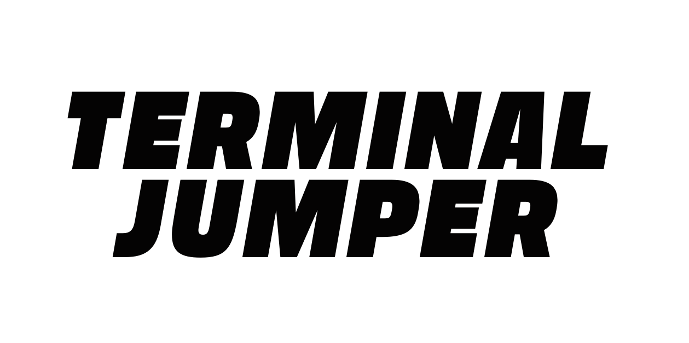

# Oblig 3 - Hackermens

- *Petter Næsset Borja, Lars Magnus Longva, Prem Eide, Viljar Slettli, Aleksander Ljosdal Fedøy, Malin Torset Sivertstøl*
- [Trello](https://trello.com/b/3IqzkDAD/hackermens)
- Manuelle tester finnes i [doc/test/manual_tests.md](./test/manual_tests.md)
- Alle møtereferater er i [doc/referater/referater.md](./referater/referater.md)



## **Prosjektrapport**

**Hvordan fungerer rollene i teamet? Trenger dere å oppdatere hvem som er teamlead eller kundekontakt?**
- Rollene i teamet fungerer ganske bra. Vi føler på dette tidspunktet at rollene som er satt funker bra og at vi nå ikke trenger å oppdatere på de.

**Trenger dere andre roller? Skriv ned noen linjer om hva de ulike rollene faktisk innebærer for dere.Trenger dere andre roller? Skriv ned noen linjer om hva de ulike rollene faktisk innebærer for dere.**
- Vi har fra første innlevering fått inn en ny på teamet, Prem, som har fått rollen som DevOps fordi DevOps metodologier legger vekt på å automatisere og optimalisere prosesser for å redusere tiden det tar å utvikle og levere programvare. Vi har sett at det kan være viktig at en i teamet har tatt på seg team lead rollen som koordinerer og delegere oppgaver i teamet. Tech lead for oss innebærer at en av oss har overordnet kontroll over koden. Resten av rollene innebærer for det meste kundekontakt og å holde et overordnet kontroll over hva og når oppgavene skal leveres inn. 

**Er det noen erfaringer enten team-messig eller mtp prosjektmetodikk som er verdt å nevne? Synes teamet at de valgene dere har tatt er gode? Hvis ikke, hva kan dere gjøre annerledes for å forbedre måten teamet fungerer på?**
- Vi føler at vi har god kontroll på koden vår nå og har vært flinke til å ta valg sammen. Vi har vært flinke til å ikke overvelde oss slik at vi leverer pen og ryddig kode i stedet for noe halvferdig som verken ser bra ut eller er ryddig.

**Hvordan er gruppedynamikken? Er det uenigheter som bør løses?**
- Vi har tidligere hatt litt problemer med sent oppmøte eller at folk ikke dukker opp uten å gi beskjed til gruppen. Dette har blitt litt bedre, men er fortsatt et problem. Gruppedynamikken har blitt veldig bra nå som vi nærmer oss sluttstadiet og vi har blitt enige i hvordan spillet skal funke og se ut. Det var noe som vi slet med i starten, men har nå i senere tid funnet ut av det. 

**Hvordan fungerer kommunikasjonen for dere?**
- Som sagt har kommunikasjonen falt litt kort når det gjelder å si ifra om folk er forsinket eller ikke kan møte på noen av møtene. Men ellers har Discord funket bra som kommunikasjonskanal.

**Gjør et kort retrospektiv hvor dere vurderer hva dere har klart til nå, og hva som kan forbedres. Dette skal handle om prosjektstruktur, ikke kode. Dere kan selvsagt diskutere kode, men dette handler ikke om feilretting, men om hvordan man jobber og kommuniserer.**
- På retrospektiv ble vi enige om at alle er fornøyde med hvordan vi ligger ann til å bli helt ferdig med spillet og alle er fornøyde med den retningen oppgaven går i. Vi tenker at det å møte opp på møter og i det minste si ifra når du ikke kan møte slik at vi heller kan endre på tiden eller sette opp et helt nytt møte er noe som vi kan bli bedre på. Vi er da veldig fornøyde med hvordan vi setter opp oppgaver som skal gjørest til neste møte, da dette har fungert veldig bra.

**Under vurdering vil det vektlegges at alle bidrar til kodebasen. Hvis det er stor forskjell i hvem som committer, må dere legge ved en kort forklaring for hvorfor det er sånn. Husk å committe alt. (Også designfiler)**
- Som sagt tidligere har det vært litt problem med skjelett koden så for at det skal være med oversiktelig og ryddig i starten har vi sagt oss enige i at kanskje en eller to personer skulle fikse opp i dette gjennom git. Samtidig har vi gjennom prosjektet fått to nye medlemmer, en som ikke møtte opp før tredje møtet og en som kom fra en annen gruppe, så vi har brukt tid på å integrere de i koden vår og justert prosjektet til flere medlemmer. Vi har også prøvd å dele ut oppgaver til folk så noen har mer om skrivingen og kanskje lage spillbrettet og spritsene, mens andre har fått i oppgave å implementere forskjellige metoder. Samtidig har vi sagt at rett før innleveringen skal inn, så skal en av oss gå å sjekke over og rydde opp i prosjektet slik at vi er sikre på at det vi leverer er godt nok.

**Bli enige om maks tre forbedringspunkter fra retrospektivet, som skal følges opp under neste sprint.**
- Til neste innlevering vil vi fokusere på disse forbedringspunktene:
    - Oppmøte på møter
    - Sette mål for sprinter og ikke for hver innlevering
    - Mer parprogrammering

I forrige oblig hadde vi satt opp effektivitet på møtene, bli flinkere på å sette opp ting å gjøre mellom møtene og bli flinkere på kommunikasjon som tre forbedringspunkter til neste sprint. Vi kan si oss fornøyde med at vi har blitt bedre på alle tre punktene, noe som førte til at vi ble mer effektive og det var enklere å samarbeide og kommunisere med hverandre.

## **Krav og spesifikasjon**

### MVP-kravene våre:

```
1. Vise startskjerm.
2. Ha fungerende knapper/funksjoner til startskjermen. 
3. Vis spiller på spillebrettet. 
4. Flytt spiller (inklusiv tyngdekraft, kunne hoppe)
5. Spiller interagerar med terrenget. 
6. Dynamisk grafikk avhengig av hvor spilleren befinner seg. 
7. Spiller kan dø (dersom man faller utenfor skjermen eller at skjermen tar den igjen).
8. Mål for spillbrett (oppnå høyest mulig poengscore, overleve lengst mulig eller hoppe høyeste mulig).
9. Nytt spillbrett når forrige er ferdig.
10. Game over skjer (viser statistikk for runden, start på nytt knapp). 
```

**Oppdater hvilke krav dere har prioritert, hvor langt dere har kommet og hva dere har gjort siden forrige gang. Er dere kommet forbi MVP? Forklar hvordan dere prioriterer ny funksjonalitet.**

- Til oblig 3 prioriterte vi å bli ferdige med alle MVP kravene våre. Fra oblig 2 hadde vi klart de 3 første men vi er nå ferdig med alle 10 kravene. Vi har også implementert lyd, f.eks. når du hopper, og at musikken endrer seg når du dør i spillet. I tillegg har vi fikset en settings knapp på start skjermen der man kan justere volumet på musikken. 
- Til neste gang vil vi fokusere på å finpusse og forbedre gameplay, samt fikse bugs med f.eks hopping. Vi vil også forsøke å få inn animasjoner. Eksempelvis trenger UI-finpuss, da spesielt Settings-knappen ikke ser bra ut.
    - Kodekvaliteten må også videre forbedres, inkludert tester, MVC, SOLID og mer bruk av interfaces.

**For hvert krav dere jobber med, må dere lage (1) ordentlige brukerhistorier, (2) akseptansekriterier og (3) arbeidsoppgaver. Husk at akseptansekriterier ofte skrives mer eller mindre som tester**

- Vise startskjerm:
    - Som bruker vil jeg ha en fin og oversiktlig startskjerm slik at jeg kan starte spillet. 
    - Da trenger vi en organisert startskjerm
    - For dette må vi lage en egen klasse som heter MainMenuScreeen.java som inneholder grafikken som gjør startskjermen oversiktlig og en button listener som responderer når brukeren trykker start eller stop.

- Ha fungerende knapper/funksjoner til startskjerm:
    - Som utvikler vil jeg at knappene vi implementerer på startskjermen skal ha riktig funksjon.
    - Da trenger vi Start og Stop knapp, der start knappen gjør at spillet starter og stop gjør at spillet avsluttes.
    -  For dette må vi lage et Table i MainMenuScreen som brukes til å plassere knapper og andre UI-elementer. Inni Table må det lages to knapper, som hver har listeners for trykk. Disse må respondere raskt, og laste spillet eller avslutte programmet. Vi må også designe grafikk for knappene, slik at det for brukeren er tydelig hvilken knapp som gjør hva.

- Vise spiller på spillbrettet:
    - Som bruker vil jeg kunne flytte rundt på spilleren.
    - Da trenger vi en flyttbar spiller som kan bevege seg til høyre og venstre.

- Flytt spiller (inklusiv tyngdekraft, kunne hoppe)
    - Som spiller vil jeg kunne flytte rundt på spilleren i tillegg til å hoppe for å unngå hindringer og terreng.
    - For å oppnå dette må vi implementere en bevegelsesmekanisme for spilleren som tar hensyn til tyngdekraften og muligheten for å hoppe. Vi må også implementere kollisjon med terreng og hindringer for å hindre at spilleren faller gjennom.

- Spiller interagerer med terrenget:
    - Som spiller vil jeg kunne kollidere med terreng og hindringer på en realistisk måte.
    - For å oppnå dette må vi implementere en kollisjonsdeteksjonsmekanisme mellom spilleren og terrenget. Terrenget må være representert ved en grafisk modell som også tar hensyn til spillerens bevegelser og kollisjoner.

- Dynamisk grafikk avhengig av hvor spilleren befinner seg:
    - Som spiller vil jeg at grafikken i spillet skal endre seg avhengig av hvor jeg befinner meg.
    - For å oppnå dette må vi implementere en dynamisk grafikkmekanisme som gjør at kameraet flytter seg oppover gjennom terrenget.

- Spiller kan dø (dersom man faller utenfor skjermen eller at skjermen tar den igjen):
    - Som spiller vil jeg at spillet skal være utfordrende og realistisk, og at jeg kan dø hvis jeg ikke klarer å unngå hindringer eller holder meg innenfor skjermen.
    - For å oppnå dette må vi implementere en mekanisme som avslutter spillet når spilleren faller utenfor skjermen eller blir fanget igjen av skjermen.

- Mål for spillbrett (oppnå høyest mulig poengscore, overleve lengst mulig eller hoppe høyeste mulig):
    - Som spiller vil jeg ha et klart mål for spillet, slik at jeg har noe å jobbe mot og en grunn til å spille igjen.
    - For å oppnå dette må vi implementere et poengsystem og et mål for spillet som er å overleve lengst mulig.

- Nytt spillbrett når forrige er ferdig:
    - Som spiller vil jeg ha muligheten til å spille igjen etter at jeg har fullført en runde.
    - For å oppnå dette må vi implementere en mekanisme som genererer et nytt spillbrett når spilleren fullfører en runde eller når spilleren velger å starte på nytt.

- Game over skjer (viser statistikk for runden, start på nytt knapp):
    - Som spiller vil jeg at spillet skal avsluttes på en tydelig måte når jeg dør.
    - For å oppnå dette må vi implementere en game over skjerm, der spilleren får valget om å avslutte spillet eller starte på nytt. På denne skjermen skal man også få opp poengene for runden.

**Forklar kort hvordan dere har prioritert oppgavene fremover. Har dere gjort justeringer på kravene som er med i MVP? Forklar i så fall hvorfor. Hvis det er gjort endringer i rekkefølge utfra hva som er gitt fra kunde, hvorfor er dette gjort?**
- Vi har ikke endret noe på MVP kravene våre men til siste innlevering skal vi sette opp nye krav som blir en fortsettelse av de kravene vi har gjort ferdig. 

**Husk å skrive hvilke bugs som finnes i de kravene dere har utført (dersom det finnes bugs).**
- På grunn av måten input sjekkes, kan man noen ganger "bomme" på riktig tidsvindu når man forsøker å hoppe.  Dette fører til at spilleren i blant kan føle at de blir "stuck" når de forsøker å hoppe.
    - Siden dette ikke skjer hver gang man trykker space, kan man trykke igjen til det funker. Men det føles ikke bra.
- Krasj ved resizing av vindu på macOS
  - Kjent problem i LibGDX som kan være spesifikk til M1-prosessorer

## Produkt og Kode

**Dette har vi gjort siden sist:**
- Fikset slik at kameraet beveger seg oppover i banen.
- Implementert lyder og musikk
- Game over skjerm
- Poengsystem
- Laget sprites
- At spiller dør om han faller utenfor kameraet.
- Implementert double jump.
- Designet ulike baner
- Treffer du en "power-down" så dør du
- Auto generere "power-downs"
- Skrevet tester

Det grunnleggende med gameplay er med andre ord på plass, noe som vises tydelig i skjermbildene under.

### Skjermbilder

Her en sammenligning med spillet i nåværende stadie og ved forrige innlevering:

**In-game Oblig 3 (midt i transition mellom to typer bane):**

**In-game Oblig 2: (statisk skjerm)**


I tillegg er det nå langt til en game-over skjerm samt en settings-skjerm.

## Klassediagram

Hvis diagrammene ikke vises ordentlig her er de tilgjengelige i `doc/img/oblig3`

### Enkelt klassediagram


### Detaljert klassediagram

